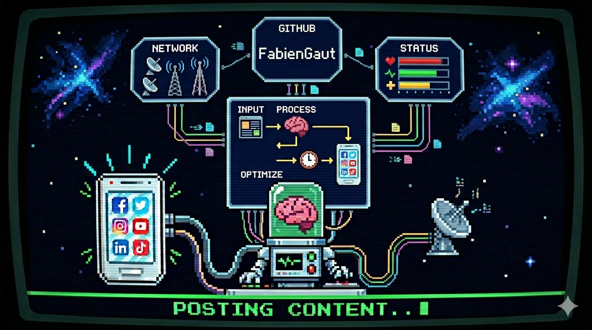

# 🚧 SocialPipeline 🚧



An intelligent automated tool designed to optimize and publish your content across social media platforms with ease.

---

## 💡 About the project

This project was built with the goal of creating an automated content creation and distribution pipeline. The system transforms a simple text input into an optimized post using AI, selects a relevant image via APIs or AI generation, and applies a visual template to produce a ready-to-publish asset. Finally, it orchestrates distribution across multiple platforms (Facebook, Twitter, Instagram, LinkedIn, TikTok), adapting the format to each network.

- Full automation: No more manual posting.
- Smart optimization: Content is processed before publishing.
- Multi-platform: One workflow for all your social networks.

---

## 🎛️ Airtable — cockpit du pipeline

Airtable est le **pilote** de l'application : c'est la seule interface à manipuler au quotidien. Toute la pipeline (sélection du texte, génération de l'image, publication, suivi) démarre à partir d'une ligne Airtable.

**Rôle concret**
- **Source de vérité des posts** : chaque ligne représente un post à publier (`Thème`, `Texte`, `Taille`, `Type`, `Image`, `Résumé AI`).
- **File d'attente** : `main.py` lit le premier record dont la case `Posté` n'est pas cochée via `src/Airtable/DataRetriver.py::get_next_unposted()`.
- **Traçabilité** : dès que la génération aboutit sans erreur, la case `Posté` est cochée automatiquement (`mark_as_posted`) — plus besoin de synchroniser un fichier JSON local.
- **Contrôle éditorial** : ajouter / réordonner / désactiver un post se fait directement dans la base Airtable, sans toucher au code.

**Configuration requise**
- Variable d'environnement `AIRTABLE_API_KEY` dans `.env`.
- Base et table ciblées dans `src/Airtable/DataRetriver.py` (`BASE_ID`, `TABLE`).
- Champ checkbox `Posté` présent sur la table.

---

## 🚀 Installation

```bash
# Clone the repository
git clone https://github.com/FabienGaut/SocialPipeline.git

# Move into the directory
cd SocialPipeline

# Install dependencies
pip install -r requirements.txt
```

Design the templates as you want to suit your needs !
